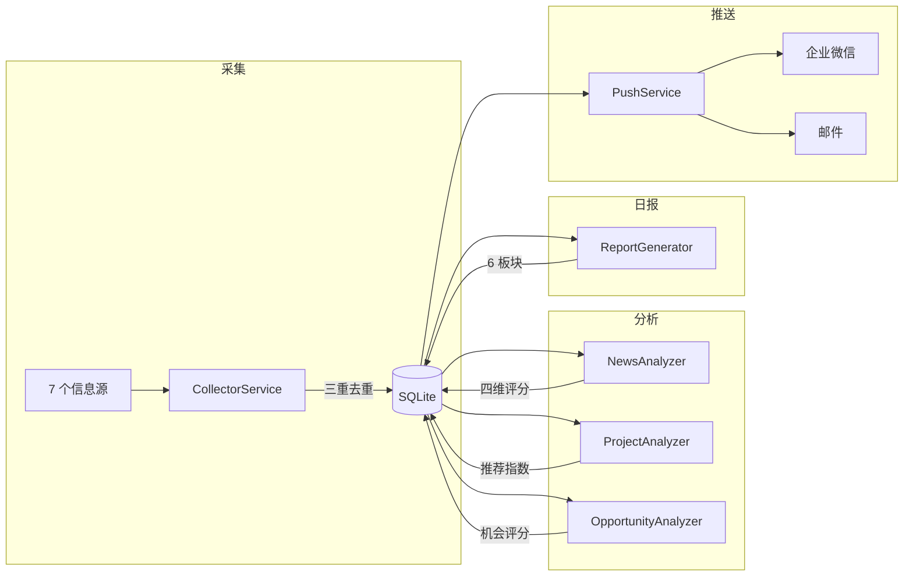

# AI机会雷达

自动采集 7 个 AI 信息源，用 LLM 分析并生成中文日报的聚合平台。

## 当前文档结构

| 文档 | 职责 |
|------|------|
| README.md | 项目简介、启动指南、GitHub 展示 |
| PRD.md | 产品需求、用户画像、MVP 范围 |
| architecture.md | 系统架构、模块设计、数据流 |
| planning.md | 开发规划、里程碑、ADR |
| task.md | P0/P1/P2 任务看板、进度追踪 |

## 当前技术栈

| 层 | 技术 |
|----|------|
| 后端 | FastAPI (Python 3.11) |
| 前端 | Jinja2 + TailwindCSS CDN |
| 数据库 | SQLite + SQLAlchemy 2.0 async |
| 缓存 | 无（MVP 不需要） |
| 部署 | Docker + docker-compose |
| AI 模型 | DeepSeek / 通义千问 / GLM / OpenAI |

## 当前完成情况

**已完成：** 项目骨架、10 张 ORM 表、配置管理、7 源采集器（RSS/API/Web）、三重去重、LLM 客户端、资讯分析器 + 聚合分析器、项目分析器 + 机会分析器、日报生成器（6 板块）、企微/邮件推送、APScheduler 定时任务（4 个）、Web 页面（日报/资讯/项目/机会/岗位/配置/日志）、REST API（31 个端点）、Pydantic Schema、DeepSeek API 已验证。

## 当前代码审查结论

### P0（阻塞级）✅ 已全部修复

- ✅ GitHub Trending 选择器修复 — `a.Link--muted` → `a[href*='/stargazers']`
- ✅ httpx 共享 Client — `BaseCollector` 新增共享 `httpx.AsyncClient`，`APICollector._get_json` 和 `WebCollector._get_soup` 复用同一连接
- ✅ SuccessResponse 统一 — 7 处路由调用统一添加 `.model_dump()`

### P1（重要）

- Product Hunt GraphQL API — 当前 SPA 爬取几乎无效，需改用官方 API
- 删除死代码 — `generator.py` 中 `_get_news_analyses` 存在废弃的空循环查询
- helpers.py 重构 — `_json_or_none` 在 3 个分析器中重复，需提取到公共工具

### P2（增强）

- `_ensure_llm` 非协程安全 — 加 `asyncio.Lock` 保护
- `clamp` 类型注解不匹配 — 支持 `float`
- import 风格不统一 — 路由层函数内/文件顶部混用

## 当前架构

## 数据库概要

| 表 | 用途 |
|----|------|
| collection_sources | 7 个采集源配置 |
| news_items | 原始资讯（50-80/天） |
| analysis_results | 分析结果（四维评分+注意力等级） |
| daily_reports | 日报 |
| report_items | 日报各板块内容 |
| open_source_projects | GitHub 项目 |
| project_analysis | 项目分析（推荐指数） |
| startup_opportunities | 创业机会 |
| opportunity_analysis | 机会分析（机会评分） |
| job_trends / job_skills | 岗位趋势与技能 |
| system_config | 运行时配置 |
| system_logs | 运行日志 |

## 当前任务状态

**P0 已完成：** 3 个阻塞级 bug 已全部修复

**P1 未完成：** Product Hunt API 适配、删除死代码、`_json_or_none` 提取

**P2 未完成：** Lock 保护、类型注解、import 风格、git 初始化

## 下一步

P0 已全部修复。建议下一步：
1. 集成测试验证采集/分析/日报全流程
2. P1 任务：Product Hunt API 适配、死代码清理、`_json_or_none` 提取
3. P2 任务：`asyncio.Lock` 保护、类型注解修复、import 风格统一

## 新会话启动指令

阅读本文档 → `docs/task.md` → `docs/architecture.md`。从 P0 列表第一个任务开始执行。运行命令：`cd /d/admin/projects/ai-daily && python -m uvicorn backend.main:app --host 0.0.0.0 --port 8000`
