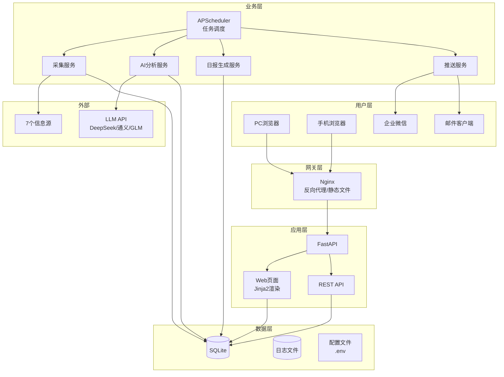
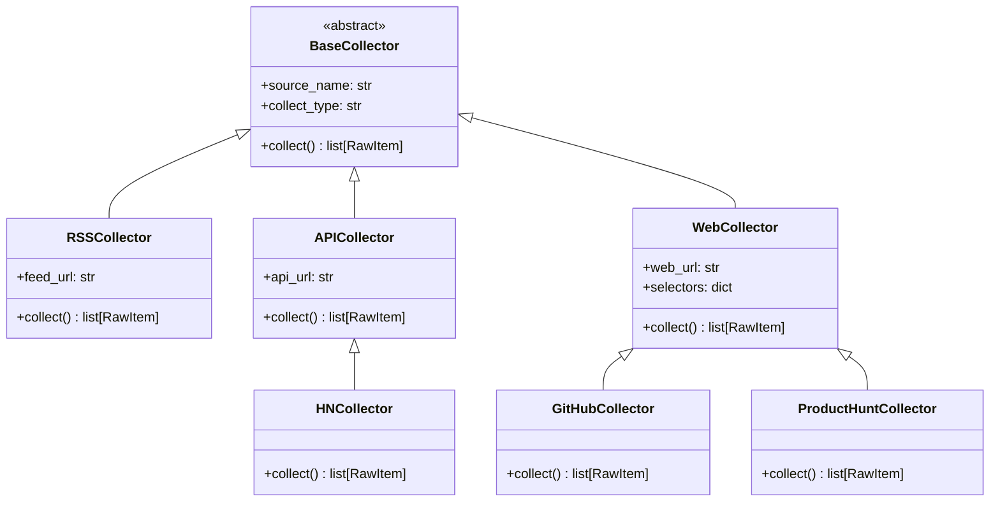
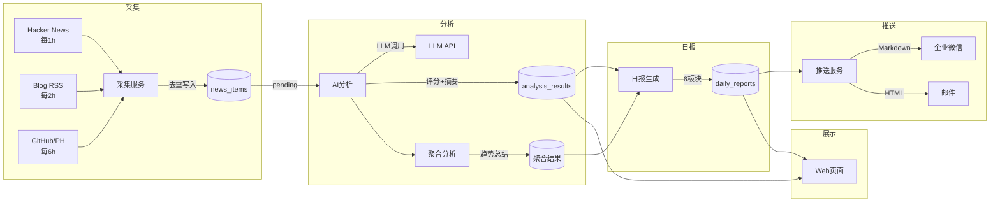
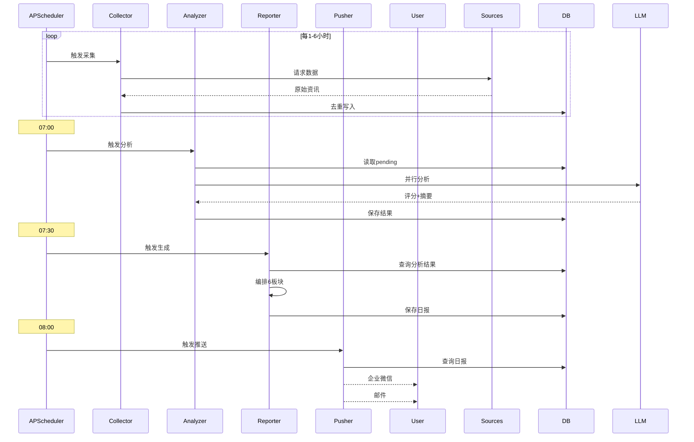
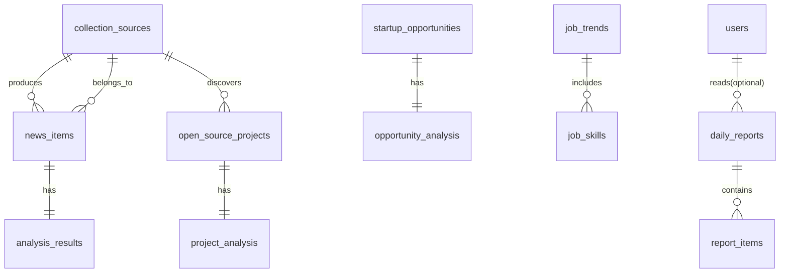
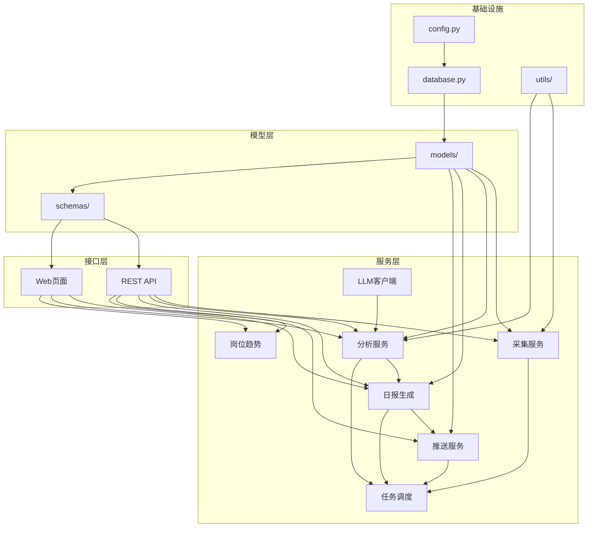
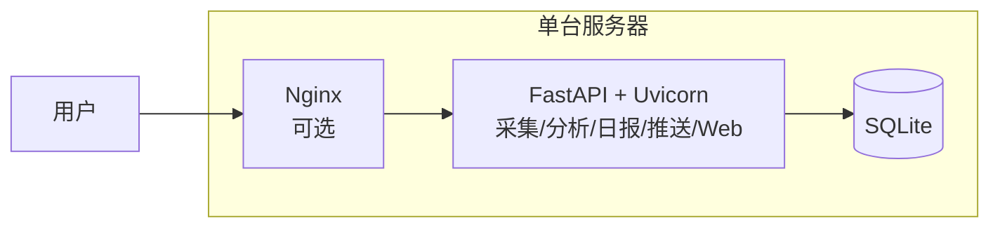
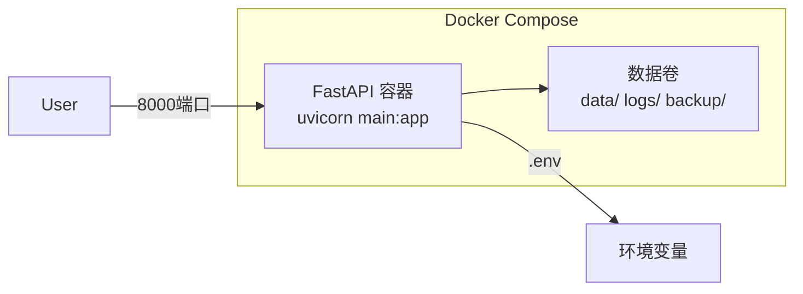
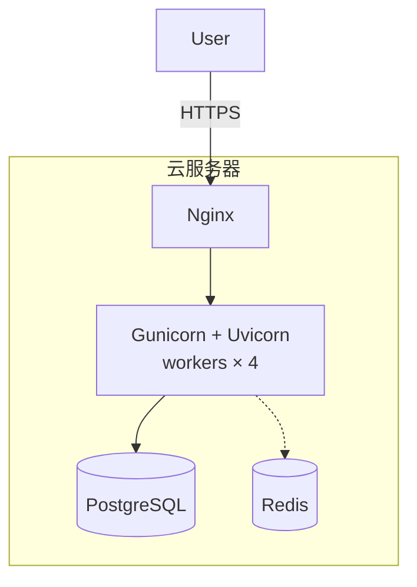

# AI机会雷达 — 系统架构设计

| 文档版本 | 修订日期 | 修订人 | 修订说明 |
|---------|---------|-------|---------|
| V1.0 | 2026-06-10 | Architect | 初始版本 |

---

> **视角：系统架构师**
>
> 本文档描述系统技术架构、模块设计、数据流和部署方案。
> 产品需求定义请参阅 [PRD.md](PRD.md)。

---

## 目录

1. [系统架构总览](#1-系统架构总览)
2. [模块设计](#2-模块设计)
3. [数据流设计](#3-数据流设计)
4. [数据库设计](#4-数据库设计)
5. [API设计](#5-api设计)
6. [模块依赖关系](#6-模块依赖关系)
7. [部署架构](#7-部署架构)
8. [技术选型](#8-技术选型)

---

## 1. 系统架构总览

### 1.1 分层架构图



### 1.2 设计原则

| 原则 | 说明 |
|------|------|
| 模块化 | 每个模块职责单一，通过数据库解耦 |
| 可替换 | 采集器/分析器/推送器均基于抽象基类，可替换实现 |
| 容错 | 单模块故障不影响整体，异常自动重试 |
| 低成本 | 优先DeepSeek API，日均成本<1元 |
| 可演进 | SQLite→PostgreSQL，单用户→多用户 |

---

## 2. 模块设计

### 2.1 模块总览

| 模块 | 目录 | 职责 | 入口 |
|------|------|------|------|
| 配置管理 | `config.py` | 环境变量 + 数据库运行时配置 | `get_settings()` |
| 数据库 | `database.py` | 异步引擎、会话管理、自动建表 | `get_db()` |
| 数据采集 | `services/collector/` | 7个源RSS/API/Web采集、去重、异常处理 | `CollectorService` |
| AI分析 | `services/analyzer/` | LLM客户端、资讯分析、聚合分析 | `AnalyzerService` |
| 日报生成 | `services/reporter/` | 内容编排、模板渲染、行动建议生成 | `ReportService` |
| 推送服务 | `services/pusher/` | 企业微信/邮件推送、重试机制 | `PushService` |
| 岗位趋势 | `services/trends/` | 岗位数据采集、技能分析 | `JobTrendService` |
| 任务调度 | `services/scheduler.py` | APScheduler定时任务管理 | `AppScheduler` |
| REST API | `routers/` | 7组REST API端点 | APIRouter |
| Web页面 | `web/routes.py` | 10个Jinja2页面路由 | APIRouter |

### 2.2 采集器设计

所有采集器继承自 `BaseCollector` 抽象基类：



### 2.3 分析器设计

分析流程分为两级：

```
资讯级分析（逐条）
  └→ 输入：单条原始资讯
  └→ 输出：摘要、四维评分、关注等级、影响分析

聚合分析（全量）
  └→ 输入：当日所有分析结果
  └→ 输出：趋势总结、热点聚类、关联事件
```

### 2.4 任务调度设计

| 任务 | 触发时间 | 执行内容 |
|------|---------|---------|
| 数据采集 | 06:00-23:00 | 按各源间隔频率自动采集 |
| AI分析 | 07:00 | 分析所有待处理资讯 |
| 聚合分析 | 07:20 | 当日趋势聚合 |
| 日报生成 | 07:30 | 6板块日报编排+保存 |
| 推送通知 | 08:00 | 企业微信+邮件推送 |

---

## 3. 数据流设计

### 3.1 主数据流



### 3.2 异常数据流

```
采集失败 → 重试3次(30s/60s/120s) → 记录ERROR → 下次周期覆盖
分析失败 → 重试3次(10s/30s/60s) → 标记failed → 下次补分析
生成失败 → 重试2次(60s/120s) → 标记failed → 手动重试
推送失败 → 重试3次(60s/120s/180s) → 记录ERROR → Web页面可查看
```

### 3.3 调度时序



---

## 4. 数据库设计

### 4.1 ER图



### 4.2 表定义

| 表名 | 说明 | MVP | 日均数据量 |
|------|------|-----|-----------|
| collection_sources | 采集源配置 | ✅ | 0（只更新） |
| news_items | 新闻资讯 | ✅ | 50-80条 |
| analysis_results | AI分析结果 | ✅ | 50-80条 |
| daily_reports | 日报 | ✅ | 1条 |
| report_items | 日报项目 | ✅ | 6条 |
| open_source_projects | 开源项目 | ✅ | 10-20条 |
| project_analysis | 项目分析 | ✅ | 10-20条 |
| startup_opportunities | 创业机会 | ✅ | 5-10条 |
| opportunity_analysis | 机会分析 | ✅ | 5-10条 |
| job_trends | 岗位趋势 | ✅ | 1条 |
| job_skills | 岗位技能 | ✅ | 10-20条 |
| system_config | 系统配置 | ✅ | 0（只更新） |
| system_logs | 系统日志 | ✅ | 100-200条 |
| users | 用户（预留） | ✅（预留） | 0 |

### 4.3 索引策略

SQLite WAL模式 + 外键约束。高频查询字段建立索引：news_items.status、news_items.published_at、analysis_results.attention_level、daily_reports.report_date、daily_reports.status、system_logs.created_at、system_logs.module。

---

## 5. API设计

### 5.1 API总览

所有API端点统一前缀 `/api/v1`，JSON格式，统一响应结构：

```json
// 成功
{"code": 200, "message": "success", "data": {}}
// 分页
{"code": 200, "message": "success", "data": {"items": [], "total": 0, "page": 1, "page_size": 20}}
// 错误
{"code": 400, "message": "错误描述", "detail": "详细信息"}
```

### 5.2 端点清单

| 分组 | 方法 | 路径 | 说明 |
|------|------|------|------|
| 日报 | GET | `/api/v1/reports` | 日报列表（分页） |
| 日报 | GET | `/api/v1/reports/today` | 今日日报 |
| 日报 | GET | `/api/v1/reports/{date}` | 指定日期日报 |
| 日报 | POST | `/api/v1/reports/generate` | 手动生成日报 |
| 资讯 | GET | `/api/v1/news` | 资讯列表（筛选+分页） |
| 资讯 | GET | `/api/v1/news/{id}` | 资讯详情+分析结果 |
| 资讯 | POST | `/api/v1/news/analyze/{id}` | 手动分析单条 |
| 项目 | GET | `/api/v1/projects` | 项目列表 |
| 项目 | GET | `/api/v1/projects/{id}` | 项目详情 |
| 项目 | GET | `/api/v1/projects/trending` | 热门推荐 |
| 机会 | GET | `/api/v1/opportunities` | 机会列表 |
| 机会 | GET | `/api/v1/opportunities/{id}` | 机会详情 |
| 岗位 | GET | `/api/v1/jobs` | 岗位趋势 |
| 仪表盘 | GET | `/api/v1/dashboard/stats` | 仪表盘统计 |
| 系统 | GET | `/api/v1/system/config` | 获取配置 |
| 系统 | PUT | `/api/v1/system/config/{key}` | 更新配置 |
| 系统 | POST | `/api/v1/system/collect` | 手动采集 |
| 系统 | POST | `/api/v1/system/push/retry` | 重试推送 |
| 系统 | GET | `/api/v1/system/logs` | 查看日志 |

### 5.3 全局错误码

| 错误码 | 含义 |
|-------|------|
| 200 | 成功 |
| 400 | 参数错误 |
| 404 | 资源不存在 |
| 409 | 资源冲突（如正在生成中） |
| 422 | 请求体验证失败 |
| 429 | 请求频率过高 |
| 500 | 服务器内部错误 |

---

## 6. 模块依赖关系

### 6.1 依赖图



### 6.2 关键依赖说明

| 依赖 | 方式 | 设计要点 |
|------|------|---------|
| 采集→分析 | 数据库状态 | 采集写入news_items(status=pending)，分析器轮询处理 |
| 分析→日报 | 数据库查询 | 日报生成器查询当日所有analysis_results |
| 日报→推送 | 数据库查询 | 推送服务查询当日daily_reports |
| 路由→服务 | FastAPI依赖注入 | 路由函数通过Depends(get_db)获取数据库会话 |
| 服务→模型 | SQLAlchemy ORM | 所有数据操作通过ORM模型 |

---

## 7. 部署架构

### 7.1 MVP单机部署



### 7.2 Docker部署



### 7.3 生产环境部署



---

## 8. 技术选型

### 8.1 技术栈对比

| 选型 | 选择 | 备选 | 决策理由 |
|------|------|------|---------|
| Web框架 | FastAPI | Flask/Django | 原生异步、自动API文档 |
| ORM | SQLAlchemy 2.0 | 直接SQL | 迁移方便、类型安全 |
| 数据库 | SQLite | PostgreSQL | 零配置、足够MVP |
| 调度 | APScheduler | Celery | 零外部依赖 |
| 前端 | TailwindCSS CDN | TailwindCLI | 无构建步骤 |
| AI | DeepSeek API | OpenAI/Claude | 国内可用、成本低 |

### 8.2 第三方依赖

```
核心框架：fastapi, uvicorn, pydantic, pydantic-settings
数据库：sqlalchemy[asyncio], aiosqlite
模板：jinja2, aiofiles, markdown
采集：httpx, beautifulsoup4, feedparser, lxml
AI：openai（兼容DeepSeek等）
调度：apscheduler
工具：loguru, python-dotenv
```

### 8.3 架构决策记录（ADR）

| ADR | 决策 | 核心原因 |
|-----|------|---------|
| ADR-001 | FastAPI > Flask/Django | 原生异步 + 自动API文档 |
| ADR-002 | SQLAlchemy > 直接SQL | 后续可迁移PostgreSQL |
| ADR-003 | APScheduler > Celery | 零外部依赖，单机够用 |
| ADR-004 | TailwindCDN > 构建工具 | 无npm/webpack依赖 |
| ADR-005 | DeepSeek > OpenAI | 国内稳定、成本1/10 |
| ADR-006 | 数据库解耦 > 消息队列 | 零额外组件、实现简单 |
