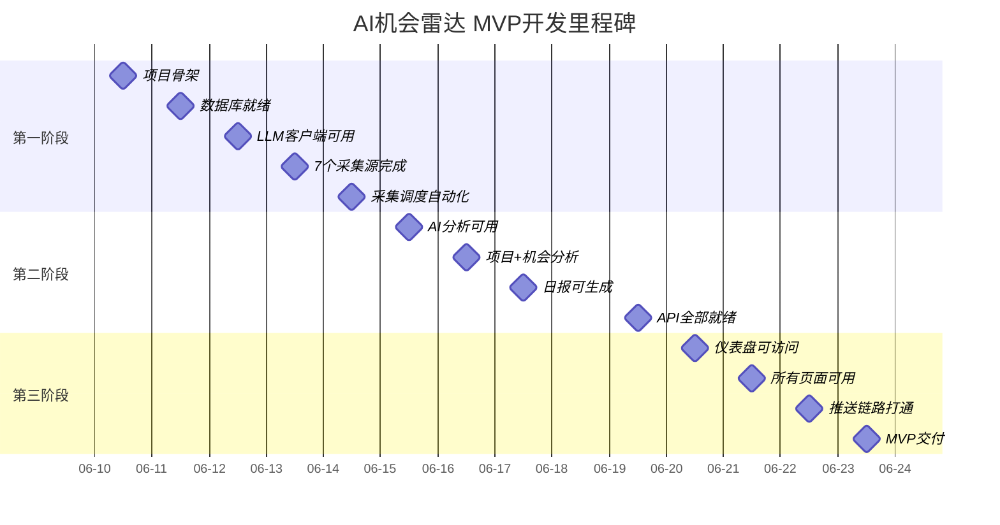

# AI机会雷达 — 开发规划（Planning）

| 文档版本 | 修订日期 | 修订人 | 修订说明 |
|---------|---------|-------|---------|
| V1.0 | 2026-06-10 | PM | 初始版本 |

---

> **视角：项目经理**
>
> 本文档描述开发阶段划分、里程碑、风险管理和版本路线图。
> 具体开发任务清单请参阅 [task.md](task.md)。
> 技术架构详情请参阅 [architecture.md](architecture.md)。

---

## 目录

1. [开发哲学](#1-开发哲学)
2. [MVP成功标准](#2-mvp成功标准)
3. [开发阶段规划](#3-开发阶段规划)
4. [里程碑](#4-里程碑)
5. [风险管理](#5-风险管理)
6. [发布计划](#6-发布计划)
7. [版本路线图](#7-版本路线图)
8. [架构决策记录](#8-架构决策记录)

---

## 1. 开发哲学

```
简单 > 完美
  优先实现能跑通的功能，不追求一次性完美
  后续通过迭代优化

可运行 > 可扩展
  MVP阶段以功能可用为首要目标
  预留扩展点但不提前实现

可观测 > 可优化
  先有日志看到发生了什么
  再考虑性能优化

验证 > 设计
  每个任务完成后手动验证
  不花时间写自动化测试（MVP阶段）
```

---

## 2. MVP成功标准

所有指标需全部满足方可视为MVP交付完成：

| 序号 | 标准 | 验证方式 |
|-----|------|---------|
| 1 | 应用启动后自动采集7个信息源 | 查看日志采集记录 |
| 2 | 采集数据自动触发AI分析（评分+摘要） | 查看analysis_results表 |
| 3 | 每天07:30自动生成完整6板块日报 | 查看daily_reports表 |
| 4 | 每天08:00自动推送（企业微信/邮件） | 查看推送日志 |
| 5 | Web页面可查看日报、资讯、项目分析 | 浏览器访问验证 |
| 6 | 系统配置可通过Web页面修改 | 修改后验证生效 |
| 7 | 操作日志可追溯 | 日志页面查询验证 |

---

## 3. 开发阶段规划

### 第一阶段：项目骨架与数据采集（Day 1-5）

| 天数 | 主题 | 核心交付 | 工时 |
|------|------|---------|------|
| Day 1 | 项目初始化 | 目录结构、配置管理、应用入口、工具函数 | 2.5h |
| Day 2 | 数据库设计 | 10张ORM模型表、数据库引擎、索引策略 | 2.5h |
| Day 3 | LLM客户端 | OpenAI兼容SDK封装、JSON模式、错误重试 | 2h |
| Day 4 | 采集器实现 | RSS/API/Web三种采集器、7个采集源适配 | 2.5h |
| Day 5 | 采集编排调度 | 去重机制、CollectorService、APScheduler集成 | 2h |

**第一阶段验收**：✅ 7个采集源全部可采集，数据写入数据库，定时任务自动触发

### 第二阶段：AI分析 + 日报生成（Day 6-9）

| 天数 | 主题 | 核心交付 | 工时 |
|------|------|---------|------|
| Day 6 | 资讯分析 | Prompt构建、四维评分、attention_level、批量分析 | 2.5h |
| Day 7 | 项目+机会分析 | GitHub数据分析、推荐指数、商业模式评估 | 2h |
| Day 8 | 日报生成 | 6板块编排、行动建议生成、Markdown/HTML输出 | 2h |
| Day 9 | API路由 | Pydantic Schema、7组REST API端点 | 2.5h |

**第二阶段验收**：✅ 资讯AI评分正常，日报可自动生成，Swagger API可用

### 第三阶段：Web展示 + 推送 + 部署（Day 10-14）

| 天数 | 主题 | 核心交付 | 工时 |
|------|------|---------|------|
| Day 10 | Web页面基础 | 页面路由、基础模板骨架、仪表盘 | 2h |
| Day 11 | 所有页面模板 | 10个Jinja2模板、响应式布局、暗黑模式 | 2.5h |
| Day 12 | 推送+手动操作 | 企业微信推送、邮件推送、手动操作API | 2.5h |
| Day 13 | 岗位趋势+部署 | 岗位数据分析、Docker部署、启动脚本 | 2.5h |
| Day 14 | 测试+收尾 | 全流程测试、Bug修复、文档完善 | 2.5h |

**第三阶段验收**：✅ 全链路自动化运行，日报生成并推送，Docker部署成功

---

## 4. 里程碑



### 关键里程碑节点

| 里程碑 | 时间 | 含义 | 卡点风险 |
|-------|------|------|---------|
| M1: AI能力打通 | Day 3 | LLM客户端成功调用API | API Key配置、网络连通性 |
| M2: 数据能进来 | Day 5 | 所有采集源自动运行 | 反爬机制、RSS格式变化 |
| M3: 日报能生成 | Day 8 | 完整6板块日报输出 | LLM分析质量不达标 |
| M4: 能查看 | Day 11 | Web页面全部可浏览 | 模板渲染Bug |
| M5: 能收到 | Day 13 | 推送链路打通 | 企业微信配置、SMTP配置 |
| M6: MVP交付 | Day 14 | 全链路自动运行 | 集成测试发现的问题 |

---

## 5. 风险管理

### 5.1 风险矩阵

| 风险 | 概率 | 影响 | 等级 | 缓解措施 |
|------|------|------|------|---------|
| LLM API不稳定/限流 | 中 | 高 | 🔴 | 多Provider切换、重试机制、降级策略 |
| 采集源改版/反爬 | 中 | 中 | 🟠 | UA轮换、请求限速、异常告警 |
| SQLite写入冲突 | 低 | 中 | 🟡 | WAL模式、重试机制 |
| 日报生成质量差 | 中 | 中 | 🟠 | Prompt优化、人工抽检 |
| 忘记续费API Key | 低 | 高 | 🟡 | 余额检查、到期告警 |
| 磁盘空间满 | 低 | 中 | 🟡 | 30天自动清理日志和备份 |

### 5.2 降级策略

```
LLM API Key失效
  → 自动切换到备选Provider
  → 都失败则标记今日为"无分析"
  → 次日自动恢复

采集源改版
  → 记录原始HTML到日志
  → 人工修复采集器
  → 修复后重新采集

数据库损坏
  → 自动恢复最近备份
  → 手动检查数据完整性
  → 最多丢失1天数据

推送失败
  → Web页面始终可用
  → 用户手动访问查看
```

### 5.3 MVP明确不做

| 事项 | 理由 | 计划版本 |
|------|------|---------|
| 用户认证系统 | 单用户模式 | V2.0 |
| Redis缓存 | 增加运维复杂度 | V1.1 |
| 前端构建工具 | 纯服务端渲染 | V2.0 |
| 自动化测试 | MVP手工验证 | V1.1 |
| Celery分布式 | 单进程够用 | V2.0 |
| PostgreSQL | SQLite足够 | V2.0 |
| CI/CD | 手动部署 | V2.0 |

---

## 6. 发布计划

### 6.1 本地运行检查清单

- [ ] `.env` 配置齐全（API Key、推送等）
- [ ] `python scripts/seed_data.py` 初始化成功
- [ ] `uvicorn backend.main:app` 启动无报错
- [ ] `http://localhost:8000` 仪表盘可访问
- [ ] 手动采集测试，数据写入成功
- [ ] 手动分析测试，评分结果正常
- [ ] 手动生成日报，6板块完整

### 6.2 Docker运行检查清单

- [ ] `docker build -t ai-daily .` 构建成功
- [ ] `docker-compose up -d` 启动成功
- [ ] 数据卷 `data/` `logs/` 持久化正常
- [ ] 重启容器后数据不丢失
- [ ] 健康检查通过

### 6.3 云端部署检查清单

- [ ] 域名已备案（中国境内部署需）
- [ ] SSL证书已配置
- [ ] Nginx反向代理配置
- [ ] 防火墙开放80/443
- [ ] 进程守护（supervisor/systemd）
- [ ] 自动备份已配置
- [ ] 日志轮转已配置

---

## 7. 版本路线图

### V1.0 — MVP（14天）

核心链路跑通：自动采集 → AI分析 → 日报生成 → 企业微信/邮件推送。单用户Web后台可查看日报和管理配置。

### V1.1 — 增强（发布后1-2周）

| 特性 | 说明 | 价值 |
|------|------|------|
| Redis缓存 | 日报页面缓存，加载提速 | 体验优化 |
| 自定义采集源 | 用户可添加RSS源 | 扩展性 |
| 飞书/钉钉推送 | 更多推送渠道 | 覆盖更多用户 |
| 日报PDF导出 | 本地存档 | 功能补充 |
| 资讯搜索 | 全文搜索 | 可用性提升 |

### V2.0 — 多用户（发布后1个月）

| 特性 | 说明 | 价值 |
|------|------|------|
| 用户注册登录 | JWT认证、邮箱注册 | 基础能力 |
| 多用户订阅 | 每人独立日报 | 商业模式 |
| 偏好设置 | 自定义信息源和推送时间 | 个性化 |
| PostgreSQL迁移 | 支持更大数据量 | 扩展性 |
| 收藏/标记 | 个人知识管理 | 粘性提升 |

### V2.5 — 智能增强（发布后2个月）

| 特性 | 说明 |
|------|------|
| AI对话查询 | 针对日报内容问答 |
| 个性化推荐 | 基于用户兴趣的资讯推荐 |
| 热点预测 | 识别即将爆发的技术趋势 |
| 竞品追踪 | 自动跟踪指定产品动态 |
| 周报/月报 | 周期性深度分析报告 |

### V3.0 — 商业化（发布后3个月）

| 特性 | 说明 |
|------|------|
| SaaS多租户 | 企业级多用户隔离 |
| 付费订阅 | 免费版+专业版分级 |
| 团队协作 | 共享日报、评论 |
| API开放平台 | 第三方数据接入 |
| 数据报表 | 行业趋势报告导出 |

---

## 8. 架构决策记录

| ID | 决策 | 背景 | 方案对比 | 结论 |
|----|------|------|---------|------|
| ADR-001 | FastAPI | 需要异步高性能+自动API文档 | Flask(同步/无文档) vs Django(太重) | FastAPI |
| ADR-002 | SQLAlchemy+SQLite | MVP快速迭代，后续可能迁PG | 直接aiosqlite(难迁移) vs ORM | SQLAlchemy |
| ADR-003 | APScheduler | 定时任务，零外部依赖 | Celery(需Redis) vs APScheduler(进程内) | APScheduler |
| ADR-004 | TailwindCDN | 响应式设计，无构建步骤 | TailwindCLI(需Node) vs Bootstrap(重) | TailwindCDN |
| ADR-005 | DeepSeek API | 国内可用，成本控制 | OpenAI(10×成本，国内受限) vs 通义(能力一般) | DeepSeek |
| ADR-006 | 数据库解耦 | 模块间通信，零额外组件 | 消息队列(运维复杂) vs 数据库状态(简单可靠) | 数据库 |
